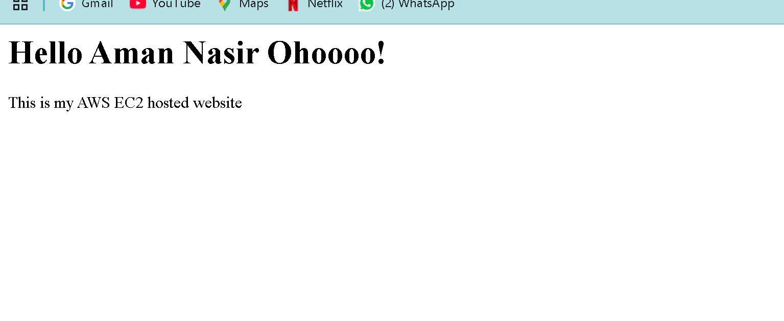
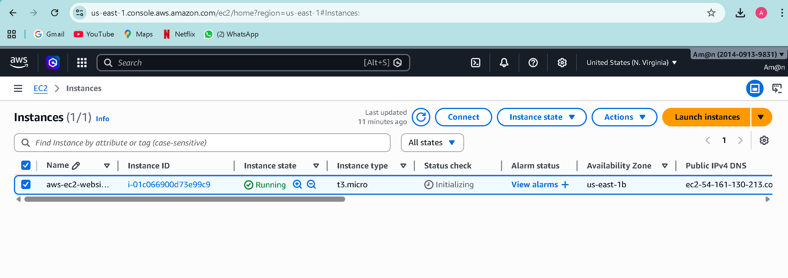
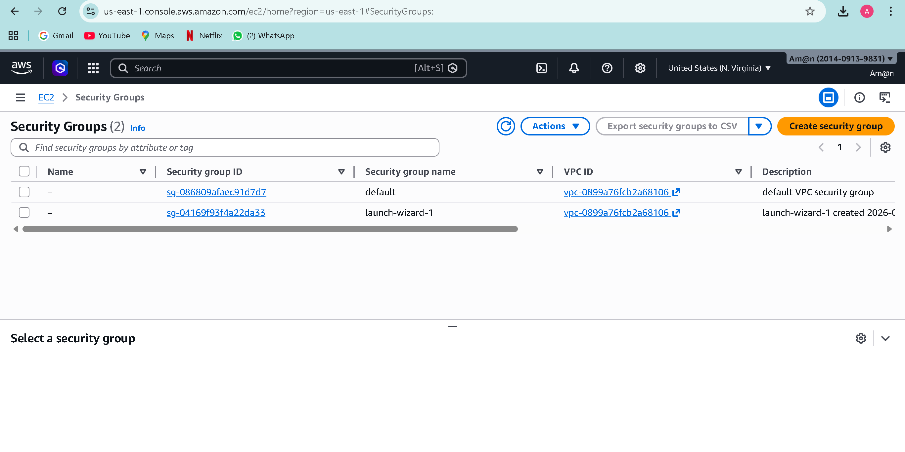
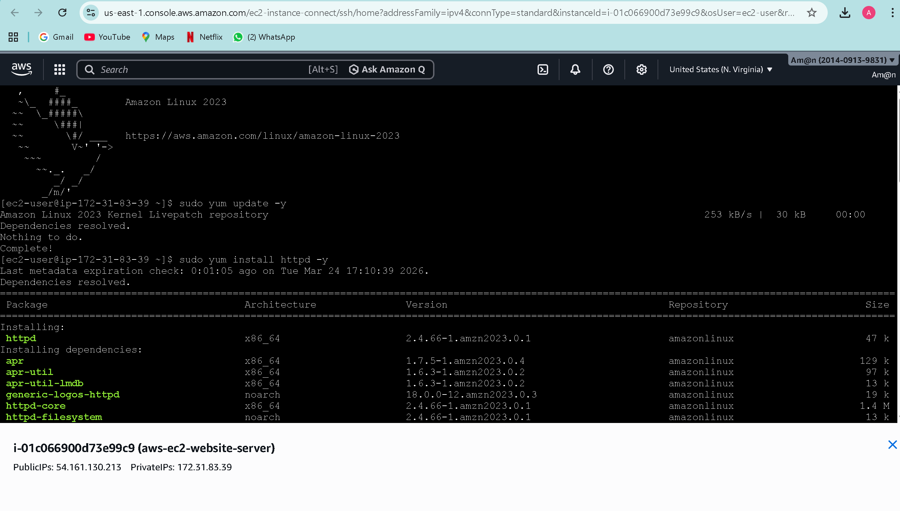

</> Markdown
## AWS EC2 Static Website Deployment
## Project Overview
This project demonstrates how to deploy a static website on AWS EC2 using Apache Web Server. The website is hosted on a Linux-based virtual machine and accessed via a public IP.

##Technologies Used
AWS EC2 (Amazon Linux)
Apache HTTP Server
Git & GitHub

## Implementation Steps
1.Launched an EC2 instance (t3.micro) on AWS
2.Configured security group to allow HTTP (port 80)
3.Connected to the instance using EC2 Instance Connect
4.Installed Apache web server
5.Deployed a static website in /var/www/html
6.Accessed the website using public IP

## Live Demo
Instance is currently stopped to avoid charges. It can be restarted anytime.
</> Markdown
### Screenshots
## Website Output

## EC2 Dashboard

## Security Group

## Terminal Setup

</> Markdown
## Key Learnings
Hands-on experience with AWS EC2
Server setup and configuration
Hosting a website on cloud infrastructure

## Author
Aman Nasir
